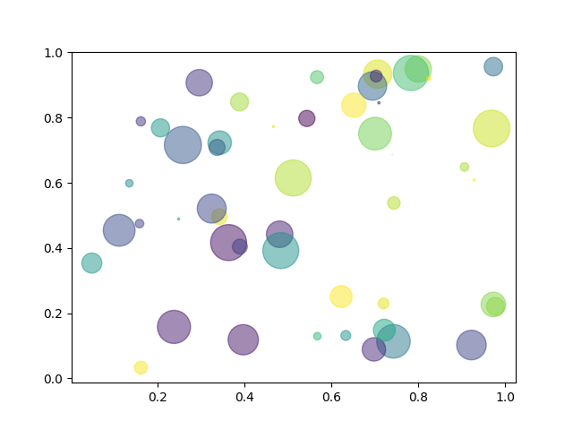

# Exploring Matplotlib

This repository contains my practice and exploration of data visualization using
Matplotlib, along with basic Pandas + Matplotlib integration.

I am learning how to create and customize different types of plots that are commonly
used in data analysis and machine learning.

---

## What I’m Exploring

- Line plots and plot customization
- Labels, titles, legends, and grid lines
- Bar charts and pie charts
- Scatter plots and histograms
- Subplots
- Pandas + Matplotlib plotting

---

## Tools Used

- Python
- Matplotlib
- NumPy
- Pandas
- Jupyter Notebook / VS Code

---

## Sample Visualizations

Line Plot  

Bar Chart  

Scatter Plot  

Histogram  

---

## Note

This repository is part of my learning journey in data visualization and will be
updated as I explore more features of Matplotlib.
